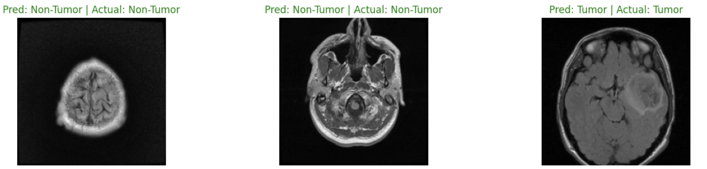
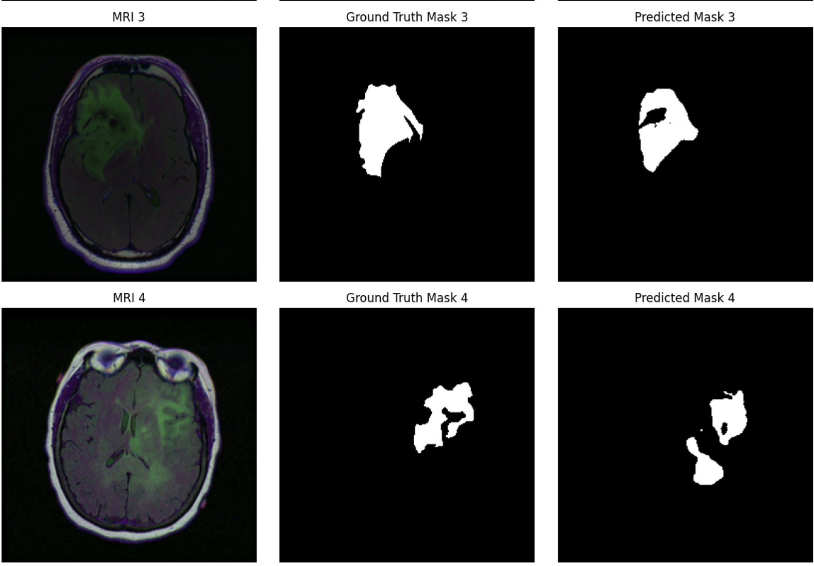

#  Brain Tumor Detection & Segmentation Using U-Net + MobileNetV2

This project performs **brain tumor detection** (classification) and **tumor region segmentation**  on MRI images using deep learning. Both tasks are powered by **MobileNetV2** — as a **classifier** for detection and as an **encoder** in a U-Net architecture for segmentation.

---

## Table of Contents

* [Overview](#overview)
* [Dataset](#dataset)
* [Tasks](#tasks)
* [Model Architectures](#model-architectures)

  * [Tumor Detection](#tumor-detection)
  * [Tumor Segmentation](#tumor-segmentation)
* [Training Details](#training-details)
* [Evaluation](#evaluation)
* [Results](#results)
* [Installation & Usage](#installation--usage)
* [Project Structure](#project-structure)
* [License](#license)

---

##  Overview

Brain tumor diagnosis from MRI scans is a critical yet time-intensive task for radiologists. This project automates two key tasks:

1. **Tumor Detection** – Classify whether a tumor is present in a given MRI slice.
2. **Tumor Segmentation** – Highlight the exact region of the tumor within the MRI scan.

We utilize **MobileNetV2** for both tasks, with transfer learning to ensure faster training and better performance on limited data.

---

##  Dataset

* **Source**: [Kaggle - Brain Tumor Segmentation Dataset (LGG)](https://www.kaggle.com/datasets/mateuszbuda/lgg-mri-segmentation)
* **Input**: Grayscale MRI images
* **Outputs**:

  * Binary label (tumor/no tumor) for detection
  * Binary mask for segmentation
* **Preprocessing**:

  * Resize to `224x224`
  * Normalize pixel values to `[0, 1]`
  * Convert grayscale → RGB for MobileNetV2

---

##  Tasks

###  Tumor Detection

* Binary classification using MobileNetV2 as a feature extractor.
* Output: 0 (no tumor) / 1 (tumor)

###  Tumor Segmentation

* Pixel-wise segmentation using a U-Net architecture with MobileNetV2 encoder.
* Output: binary mask highlighting tumor region.

---

## Model Architectures

###  Tumor Detection

* **Base Model**: MobileNetV2 (`include_top=False`)
* **Head**:

  * GlobalAveragePooling → Dense → Sigmoid
* **Loss**: Binary Crossentropy
* **Metric**: Accuracy

###  Tumor Segmentation

* **Encoder**: MobileNetV2 with frozen weights
* **Decoder**: U-Net-style upsampling with skip connections
* **Final Activation**: Sigmoid (for binary mask)
* **Loss**: Binary Crossentropy
* **Metric**: Pixel-wise accuracy

---


##  Evaluation

### Detection

* Accuracy
* Confusion Matrix

### Segmentation

* Pixel-wise Accuracy
* Dice Coefficient
* Jaccard Index (IoU)

---

##  Results





---

##  Installation & Usage

###  Requirements

```bash
pip install tensorflow scikit-learn numpy matplotlib opencv-python
```

###  Train Models

```python
# For detection:
detection_model.fit(...)

# For segmentation:
seg_model.fit(...)
```

###  Evaluate

```python
# Evaluate accuracy on test data
# Predict and visualize segmentation masks
```

---
